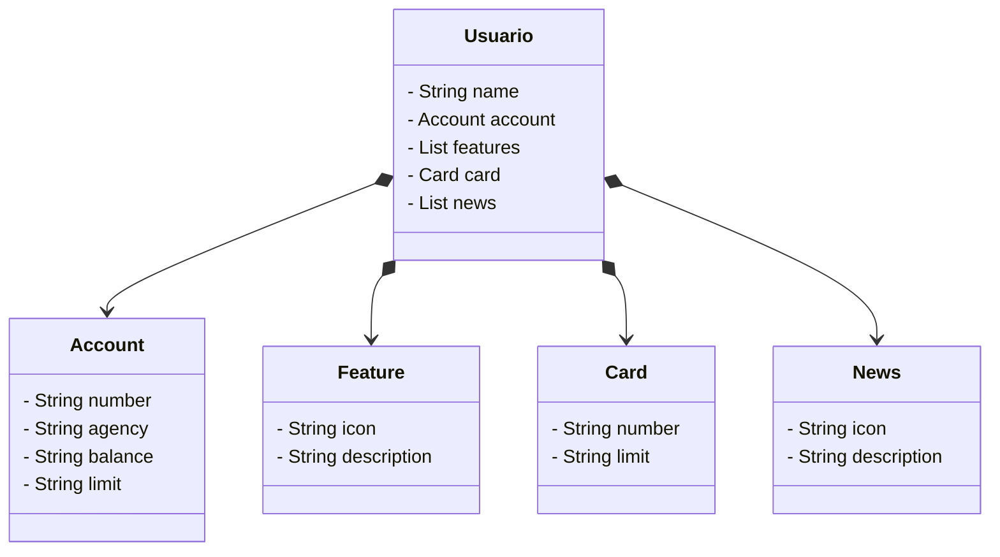

# API.Deploy

## Diagrama de Classes

```mermaid
classDiagram
    class Usuario { 
        - String name
        - Account account
        - List<Feature> features
        - Card card
        - List<News> news
    }

    class Account {
        - String number
        - String agency
        - String balance
        - String limit
    }

    class Feature {
        - String icon
        - String description
    }

    class Card {
        - String number
        - String limit
    }

    class News {
        - String icon
        - String description
    }

    Usuario *--> Account
    Usuario *--> Feature
    Usuario *--> Card
    Usuario *--> News
```
